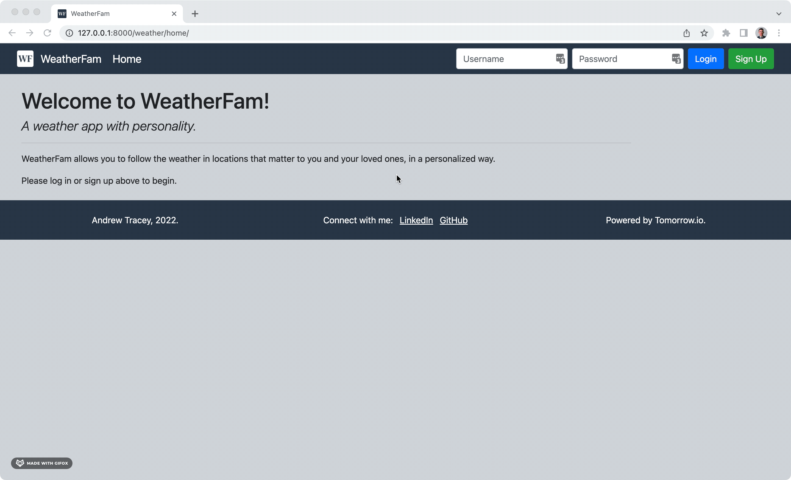

# WeatherFam
*A weather app focused on people instead of zip codes*

Live site (NO LONGER WORKING DUE TO HEROKU'S CHANGES TO FREE PLANS): https://weatherfam.herokuapp.com/

**Note:** As of October 2022, this site is no longer actively maintained. As a result, all of the functionality of the site may not work properly. If you experience an issue on the site, reloading may resolve the issue. I do not currently anticipate continuing to deploy the site once Heroku phases out free dynos in November 2022.

## Introduction

A web app that allows you to track the weather for every member of your "WeatherFam" &ndash; your friends and family living anywhere in the world.

On your home page, you can see the current and forecasted weather for all members of your WeatherFam in one place! No more scrolling through pages of saved cities and towns to find out what's happening where your loved ones are &ndash; find it all in one simple and personalized view, with the option to include a picture of each individual, and also change their location at any time.

## Purpose
After many months of dedicated studying and working on smaller projects, WeatherFam represents my first large project; an attempt to apply what I've learned so far to something interesting and useful, and to push myself to learn a lot more, about production web apps, about Django, about the SDLC, and about what the day-to-day work of a SWE looks like. In order to simulate a work environment and the Agile methodology, I used a Trello board to manage tasks and track my work throughout this project (and am still using it for deployment and additional features/bugs). [Click here](https://trello.com/b/UuAHPjXx/weatherfam-project-beta) to view the board!

When I came up with the idea for this project, I had my Mom in mind. With four sons that are now spread across the country (Maryland, New York, Illinois, and California), she always wants to know what kind of weather we're experiencing, so she knows we are safe and happy. Most weather apps are focused on seeing the forecast for one place at a time and providing every data point imaginable for that location. My goal was to bring only the pertinent information my Mom would want (temperature and primary weather event) into one simple, digestable view.

## Technology
The app is built on Django and deployed on Heroku, using a MySQL database through Heroku's ClearDB add-on. Weather data is retrieved from the Tomorrow.io API, and Google Maps API's are used for the location picking on a map and to obtain time zones for selected locations. Files are stored in an AWS S3 bucket. The front end relies on Bootstrap, with a modest amount of custom CSS and JavaScript.

# Deployment
The site has been deployed on Heroku and is live at: https://weatherfam.herokuapp.com/

Please feel free to try it out! Be aware that the number of requests to the API (Tomorrow.io) is limited under my free accout, so if you don't see any weather data dispalyed, try refreshing or trying again in a few minutes.

 

# Demos
The following gifs from my local development demonstrate the basic functionality of the site.

## Home Page - Your Full WeatherFam!

*(Don't worry, these images are all stock photos, not my family members.)*

 

## 1. Sign Up
*Please remember your password, as I don't currently have the option for password reset*

 

## 2. Add a Person
*Add a name, upload an image (square image works best), pick the location on the map, and give the location a name*

 

## 3. Edit a Person
*Edit a person's name, image, and/or location*

 

# Future Development Ideas
While I originally intended for this project to be soley educational, I've become very interested in the app and believe it may actually be useful for myself and others. I am excited about the idea of continuing to work on it, rolling out new features and functionality over time. Some of the ideas I have at this point are:

- add a search box to the map to make it easier to choose a location
- save prior locations for each person and provide a dropdown to quickly switch between locations
- add a calendar feature for each person, so that trips or moves can be added to the calendar allowing the weather data to update accordingly
- determine if it's possible to request and use location data from location sharing apps, like FindMy on iOS, so a person's location updates as they move
- add a plug-in for the image upload to allow users to preview, crop, and resize before saving
- add a more detailed view for each person, to see more weather data across more time periods, such as precipiation rates, wind speed, humidity, etc, for the next 10 hours and 7 days. This would require me to upgrade my API access!

This has been a very informative and fun project to work on, and I hope it continues to be so. I'd welcome any additional thoughts or feedback! Thanks.
